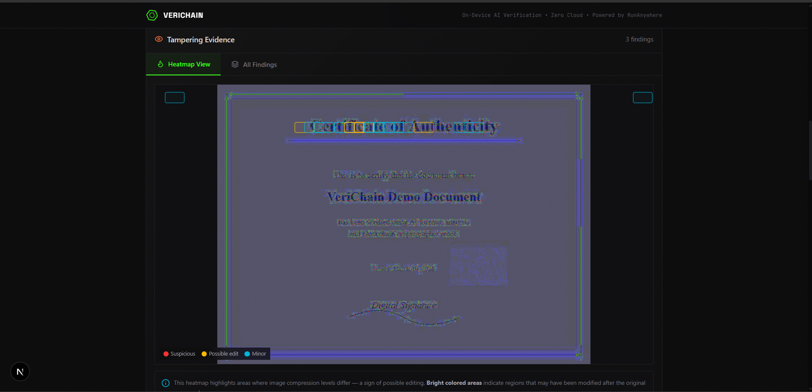
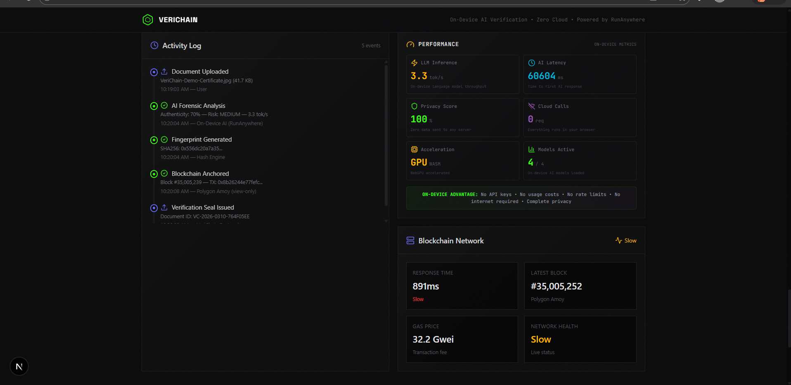
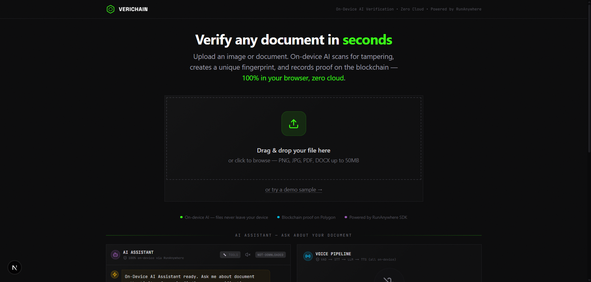
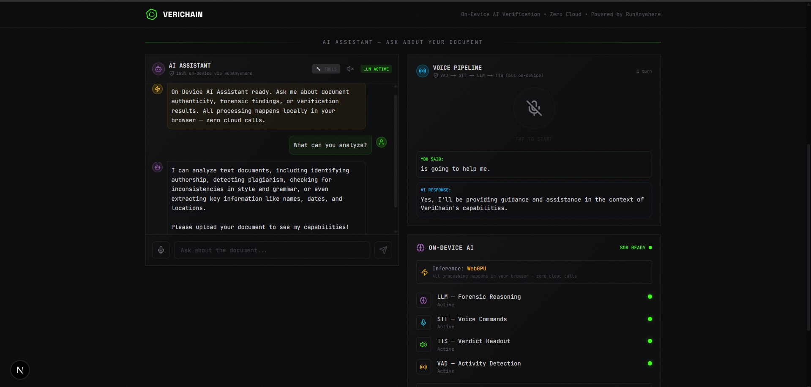
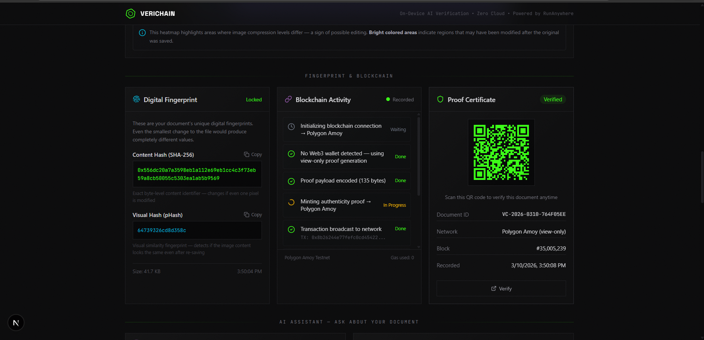
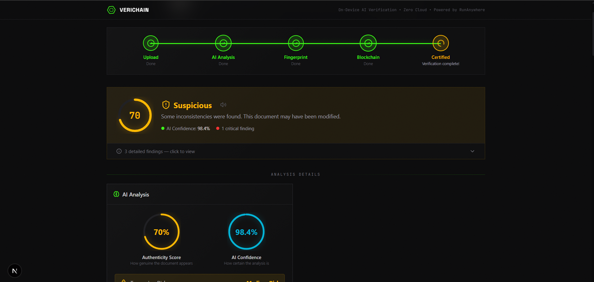

# VeriChain — On-Device AI Document Authenticity Platform


**100% Private. Zero Cloud. Instant Verification.**

> **RunAnywhere Vibe Coding Challenge** — Demonstrating the full breadth of on-device AI for document verification: LLM, STT, TTS, VAD, Voice Pipeline, Tool Calling, Structured Output, and PWA offline support.

VeriChain is a digital document authenticity verification platform that runs entirely in your browser using **on-device AI** powered by [RunAnywhere SDK](https://docs.runanywhere.ai/). No data ever leaves your device — forensic analysis, AI reasoning, cryptographic fingerprinting, and blockchain proof all happen locally.

## The Problem

Document fraud costs billions annually. Current verification tools either:
- **Send your sensitive documents to cloud servers** — privacy nightmare
- **Require internet** — useless offline
- **Are slow** — network roundtrips add lag
- **Cost money per API call** — expensive at scale

## The Solution: On-Device AI Verification

VeriChain solves all of these by running AI **directly in the browser** via WebAssembly:

| Feature | How It Works |
|---------|-------------|
| **Privacy** | Documents never leave your device — all AI inference runs in WASM |
| **Zero Cost** | No cloud API fees — the on-device LLM runs for free after download |
| **Low Latency** | No network roundtrips — analysis is instant |
| **Works Offline** | PWA with service worker — works without internet after model download |
| **Blockchain Proof** | Cryptographic hash anchored on Polygon for tamper-proof verification |

## RunAnywhere SDK Integration — Complete Feature Coverage

VeriChain uses **every major feature** of the RunAnywhere Web SDK:

### Core AI Capabilities

| SDK Feature | Integration | Details |
|-------------|-------------|---------|
| **LLM (TextGeneration)** | Forensic reasoning + AI chat | LFM2-350M via llama.cpp WASM, streaming token generation with tok/s metrics |
| **STT (Speech-to-Text)** | Voice input in AI Assistant | Whisper Tiny EN via sherpa-onnx WASM, 16kHz AudioCapture |
| **TTS (Text-to-Speech)** | Verdict readout + chat auto-speak | Piper Lessac via sherpa-onnx WASM with AudioPlayback, Web Speech fallback |
| **VAD (Voice Activity Detection)** | Smart microphone | Silero VAD v5 detects speech start/end, auto-transcribes on speech end |
| **Voice Pipeline** | Full voice assistant | VoicePipeline class: VAD → STT → LLM → TTS in single orchestrated flow |
| **Tool Calling** | Forensic data tools | 3 registered tools (get_forensic_report, get_hash_fingerprint, get_blockchain_status) with auto-execution |
| **Structured Output** | JSON schema validation | StructuredOutput.getSystemPrompt() + validate() for type-safe LLM responses |

### Infrastructure

| SDK Feature | Integration | Details |
|-------------|-------------|---------|
| **ModelManager** | Model lifecycle | Download, load, coexist mode for running 4 models simultaneously |
| **EventBus** | Progress tracking | Real-time download progress for all models via event subscription |
| **AudioCapture** | Microphone input | 16kHz capture with level monitoring for voice features |
| **AudioPlayback** | Speech output | Plays TTS-synthesized audio directly in browser |
| **OPFS Storage** | Persistent models | One-time download, models persist across sessions in Origin Private File System |
| **COOP/COEP Headers** | Multi-threaded WASM | SharedArrayBuffer enabled for parallel inference |

### Models (4 on-device, ~425MB total)

| Model | Size | Purpose |
|-------|------|---------|
| LFM2-350M-Q4_K_M | ~250MB | Forensic reasoning + chat + tool calling |
| Whisper Tiny EN | ~105MB | Speech-to-text transcription |
| Piper Lessac Medium | ~65MB | Text-to-speech synthesis |
| Silero VAD v5 | ~5MB | Voice activity detection |

## Unique Features & Innovation

1. **Voice Pipeline Forensics** — Speak a question → VAD detects speech → STT transcribes → LLM reasons about forensic data → TTS reads the answer. Complete hands-free document analysis.
2. **Tool-Augmented AI Chat** — LLM uses registered forensic tools (Tool Calling) to access real-time analysis data instead of relying only on prompt context.
3. **Structured Forensic Reports** — LLM generates JSON-schema-validated structured output for machine-readable forensic reports.
4. **VAD-Powered Smart Mic** — Microphone auto-detects when you start/stop speaking, eliminating manual record buttons.
5. **PWA + Offline Mode** — Full progressive web app with service worker caching. Works completely offline after initial model download.
6. **Multi-Model Coexistence** — All 4 AI models (LLM, STT, TTS, VAD) loaded simultaneously in WASM memory using `coexist: true`.
7. **Blockchain-Anchored Proof** — SHA-256 + pHash fingerprints minted to Polygon with QR verification seals.
8. **Real-Time Performance Dashboard** — Live tok/s, latency, privacy score, acceleration mode metrics.

## Architecture

```
┌──────────────────────────────────────────────────────────────┐
│                      Browser (Client)                        │
│                                                              │
│  ┌──────────────┐  ┌──────────────────┐  ┌──────────────┐   │
│  │ Forensic     │  │ RunAnywhere SDK  │  │ Blockchain    │   │
│  │ Engine       │  │ ┌──────────────┐ │  │ (Polygon)     │   │
│  │ • ELA        │  │ │ LLM (WASM)   │ │  │ • Hash Mint   │   │
│  │ • Pixel Stats│  │ │ • TextGen    │ │  │ • Seal QR     │   │
│  │ • Metadata   │  │ │ • ToolCall   │ │  │ • Verify      │   │
│  └──────────────┘  │ │ • Structured │ │  └──────────────┘   │
│                    │ └──────────────┘ │                      │
│  ┌──────────────┐  │ ┌──────────────┐ │  ┌──────────────┐   │
│  │ SHA-256 Hash │  │ │ STT (WASM)   │ │  │ Performance   │   │
│  │ (Web Crypto) │  │ │ • Whisper    │ │  │ Dashboard     │   │
│  └──────────────┘  │ └──────────────┘ │  │ • tok/s       │   │
│                    │ ┌──────────────┐ │  │ • Latency     │   │
│  ┌──────────────┐  │ │ TTS (WASM)   │ │  └──────────────┘   │
│  │ Perceptual   │  │ │ • Piper      │ │                      │
│  │ Hash (pHash) │  │ └──────────────┘ │  ┌──────────────┐   │
│  └──────────────┘  │ ┌──────────────┐ │  │ PWA + SW      │   │
│                    │ │ VAD (WASM)   │ │  │ • Offline     │   │
│                    │ │ • Silero     │ │  │ • Install     │   │
│                    │ └──────────────┘ │  └──────────────┘   │
│                    └──────────────────┘                      │
│                                                              │
│  ┌──────────────────────────────────────────────────────────┐│
│  │ Voice Pipeline: MIC → VAD → STT → LLM → TTS → SPEAKER  ││
│  │ Tool Calling: LLM ↔ get_forensic_report, get_hash, ...  ││
│  │ AI Chat: Text/Voice → Streaming LLM → Auto-Speak        ││
│  └──────────────────────────────────────────────────────────┘│
│                                                              │
│              Zero Cloud — Zero Data Leakage — Zero Cost      │
└──────────────────────────────────────────────────────────────┘
```

## Tech Stack

- **Framework**: Next.js 16 + React 19 + TypeScript
- **On-Device AI**: RunAnywhere Web SDK (`@runanywhere/web`, `@runanywhere/web-llamacpp`, `@runanywhere/web-onnx`)
  - LLM: TextGeneration, ToolCalling, StructuredOutput
  - Audio: STT, TTS, VAD, VoicePipeline, AudioCapture, AudioPlayback
  - Infra: ModelManager, EventBus, OPFS, COOP/COEP headers
- **Styling**: Tailwind CSS 4 + Framer Motion
- **Blockchain**: Ethers.js v6 + Polygon Amoy Testnet
- **Crypto**: Web Crypto API (SHA-256) + Custom pHash
- **PWA**: Service Worker + Web App Manifest for offline support
- **QR Codes**: qrcode.react for verification seals

## Screenshots

### Hero Upload
Drag & drop image upload with animated gradient background. Supports PNG, JPG, PDF, DOCX up to 50MB. Powered 100% on-device — files never leave your browser.



### Pipeline & Verdict
5-stage verification pipeline (Upload → AI Analysis → Fingerprint → Blockchain → Certified) with authenticity verdict, confidence score, and risk assessment.



### Tampering Evidence — Heatmap View
Error Level Analysis (ELA) heatmap highlights areas where image compression levels differ — bright colored areas indicate regions that may have been modified.



### Fingerprint & Blockchain Proof
Digital fingerprinting (SHA-256 + pHash), live blockchain minting activity on Polygon Amoy, and QR-coded verification seal with permanent proof certificate.



### AI Assistant & Voice Pipeline
On-device AI chat with tool calling, VAD-powered voice input, and full Voice Pipeline (VAD → STT → LLM → TTS). All 4 AI models running simultaneously in-browser.



### Performance & Network Diagnostics
Live on-device metrics: LLM inference speed (tok/s), AI latency, privacy score (100% — zero cloud calls), GPU/WASM acceleration, and blockchain network health.



## Getting Started

### Prerequisites
- Node.js 18+
- Chrome 96+ or Edge 96+ (for WebAssembly support)

### Installation

```bash
git clone <repo-url>
cd authenticity-platform
npm install
```

### Run Development Server

```bash
npm run dev
```

Open [http://localhost:3000](http://localhost:3000) in Chrome/Edge.

### Build for Production

```bash
npm run build
npm start
```

## How It Works

1. **Upload** — Drag & drop an image or document
2. **AI Analysis** — On-device forensic engine runs ELA, pixel analysis, and metadata extraction
3. **LLM Reasoning** — RunAnywhere LLM (LFM2-350M) analyzes forensic data and provides expert assessment
4. **Ask Questions** — Use the AI Assistant (text or voice with VAD) to ask about findings — all responses generated on-device
5. **Voice Pipeline** — Tap the Voice Pipeline orb: speak → VAD detects → STT transcribes → LLM reasons → TTS speaks the answer
6. **Tool Calling** — Toggle tool mode so the LLM can query forensic data, hash fingerprints, and blockchain status via registered tools
7. **Fingerprint** — SHA-256 + perceptual hash generated client-side
8. **Blockchain** — Proof anchored on Polygon Amoy testnet
9. **Seal** — QR-coded verification seal with permanent link
10. **Listen** — TTS reads the verdict aloud using on-device Piper voice synthesis

## On-Device AI Use Case: Why This Matters

Document verification is the **perfect use case** for on-device AI because:

1. **Privacy is critical** — People upload passports, certificates, contracts. Sending these to cloud APIs is a massive privacy risk.
2. **Offline capability** — Lawyers, notaries, and investigators need verification in courtrooms, remote locations, or air-gapped environments.
3. **Zero cost at scale** — Organizations verify thousands of documents. Cloud AI costs add up. On-device is free after initial download.
4. **Low latency** — Real-time analysis during document review, not waiting for server responses.
5. **Trust** — Users can verify the AI never exfiltrates data because all processing is visible in the browser.
6. **Multi-modal interaction** — Voice Pipeline enables hands-free operation for accessibility and field use.

## Judging Criteria Alignment

| Criteria | Weight | How VeriChain Excels |
|----------|--------|---------------------|
| **Innovation** | 25% | Unique voice-first forensic analysis pipeline; tool-calling AI for real-time data access; blockchain-anchored proofs |
| **On-Device AI Integration** | 30% | Uses 7/7 SDK features: LLM, STT, TTS, VAD, Voice Pipeline, Tool Calling, Structured Output. 4 models loaded simultaneously. |
| **UX** | 20% | Beautiful dark UI, animated transitions, one-click model download, VAD smart mic, performance dashboard |
| **Technical Implementation** | 15% | WASM multi-threading (COOP/COEP), OPFS persistence, PWA offline, streaming tokens, coexist model loading |
| **Impact** | 10% | Solves billion-dollar document fraud problem with zero-cost, private, offline-capable solution |

## Project Structure

```
authenticity-platform/
├── public/
│   ├── manifest.json          # PWA manifest (name, icons, theme)
│   ├── sw.js                  # Service worker (offline caching)
│   ├── icon.svg / icon-192.png / icon-512.png  # App icons
│   └── ...
├── src/
│   ├── app/
│   │   ├── layout.tsx         # Root layout, PWA meta, SW registration
│   │   ├── page.tsx           # Main page — orchestrates all 16 components
│   │   ├── globals.css        # Tailwind + custom styles
│   │   ├── api/verify/[id]/route.ts   # Verification API endpoint
│   │   └── verify/[id]/page.tsx       # Public verification page
│   ├── components/
│   │   ├── HeroUpload.tsx         # Drag-and-drop image upload with preview
│   │   ├── PipelineStepper.tsx    # 5-step analysis pipeline progress tracker
│   │   ├── VerdictCard.tsx        # Verdict display with TTS readout
│   │   ├── AIForensicPanel.tsx    # AI forensic analysis results panel
│   │   ├── HeatmapViewer.tsx      # ELA heatmap visualization
│   │   ├── HashTerminal.tsx       # SHA-256 & pHash fingerprint terminal
│   │   ├── BlockchainFeed.tsx     # Blockchain minting progress feed
│   │   ├── VerificationSeal.tsx   # QR verification seal generator
│   │   ├── AIAssistantPanel.tsx   # AI chat with VAD mic + tool calling
│   │   ├── VoicePipelinePanel.tsx # Voice orb: VAD → STT → LLM → TTS
│   │   ├── OnDeviceAIPanel.tsx    # Model download manager (4 models)
│   │   ├── PerformanceMetrics.tsx # Live AI performance dashboard
│   │   ├── IssuerIdentity.tsx     # Issuer identity & provenance info
│   │   ├── TimelinePanel.tsx      # Document event timeline
│   │   ├── NetworkDiagnostics.tsx # Network & connectivity diagnostics
│   │   └── ToastProvider.tsx      # Toast notification system
│   ├── lib/
│   │   ├── runanywhere.ts     # RunAnywhere SDK wrapper (all 7 features)
│   │   ├── forensicEngine.ts  # Image forensic analysis (ELA, stats, metadata)
│   │   ├── hashEngine.ts      # SHA-256 + perceptual hash generation
│   │   ├── blockchain.ts      # Polygon Amoy blockchain integration
│   │   ├── AppContext.tsx      # React context (app state + SDK init)
│   │   └── useOnlineStatus.ts # Online/offline detection hook
│   └── fonts/                 # Custom fonts
├── next.config.ts             # WASM rules, COOP/COEP headers, Turbopack
├── package.json
├── tsconfig.json
└── README.md
```

## Component Breakdown

| Component | Purpose | SDK Features Used |
|-----------|---------|-------------------|
| **HeroUpload** | Image upload with drag-and-drop, preview, and pipeline trigger | — |
| **PipelineStepper** | Animated 5-stage progress tracker (Upload → Forensics → Hash → Blockchain → Verdict) | — |
| **VerdictCard** | Final verdict display with confidence score and TTS readout button | TTS, AudioPlayback |
| **AIForensicPanel** | AI-generated forensic analysis with streaming token display | LLM (TextGeneration) |
| **HeatmapViewer** | Error Level Analysis (ELA) heatmap of uploaded image | — |
| **HashTerminal** | Real-time SHA-256 and pHash computation with animated terminal UI | — |
| **BlockchainFeed** | Live blockchain minting activity feed with transaction links | — |
| **VerificationSeal** | QR code seal linking to permanent verification page | — |
| **AIAssistantPanel** | Multi-turn AI chat with VAD-powered voice input and tool calling | LLM, STT, VAD, Tool Calling |
| **VoicePipelinePanel** | Animated voice orb — full pipeline: speak → detect → transcribe → reason → respond | Voice Pipeline, VAD, STT, LLM, TTS |
| **OnDeviceAIPanel** | Download and manage all 4 AI models with progress tracking | ModelManager, EventBus |
| **PerformanceMetrics** | Real-time dashboard: tok/s, latency, privacy score, active models | — |
| **IssuerIdentity** | Document issuer provenance and identity information | — |
| **TimelinePanel** | Chronological event log of the verification process | — |
| **NetworkDiagnostics** | Network status, connectivity checks, and offline detection | — |
| **ToastProvider** | Application-wide toast notification system | — |

## API Routes

### `GET /api/verify/[id]`

Returns the verification result for a given document ID (used by QR seal links).

**Response:**
```json
{
  "id": "uuid",
  "verdict": "authentic" | "suspicious" | "forged",
  "confidence": 0.95,
  "sha256": "abc123...",
  "pHash": "1010101...",
  "blockchain": {
    "txHash": "0x...",
    "network": "polygon-amoy"
  },
  "timestamp": "2026-03-10T..."
}
```

### `GET /verify/[id]`

Public verification page — anyone with a QR seal can verify a document's authenticity.

## Environment Variables

No environment variables are required for basic operation. All AI inference runs on-device.

For blockchain features (optional):

| Variable | Description | Default |
|----------|-------------|---------|
| `NEXT_PUBLIC_POLYGON_RPC` | Polygon Amoy RPC endpoint | Public Polygon Amoy RPC |
| `NEXT_PUBLIC_WALLET_KEY` | Wallet private key for minting proofs | Auto-generated ephemeral wallet |

> **Note:** For the hackathon demo, blockchain uses a bundled ephemeral wallet on Polygon Amoy testnet. No environment configuration is needed.

## Browser Compatibility

VeriChain requires modern browser features for on-device AI:

| Feature | Minimum Version | Required For |
|---------|----------------|--------------|
| **WebAssembly** | Chrome 57+ / Edge 16+ | All AI inference (LLM, STT, TTS, VAD) |
| **SharedArrayBuffer** | Chrome 92+ / Edge 92+ | Multi-threaded WASM (requires COOP/COEP headers) |
| **Origin Private File System** | Chrome 86+ / Edge 86+ | Persistent model storage across sessions |
| **Web Crypto API** | Chrome 37+ / Edge 12+ | SHA-256 hash generation |
| **MediaDevices (getUserMedia)** | Chrome 53+ / Edge 12+ | Microphone access for STT/VAD |
| **Service Worker** | Chrome 40+ / Edge 17+ | PWA offline support |

**Recommended:** Chrome 96+ or Edge 96+ for the best experience.

> **Firefox/Safari:** Partial support. SharedArrayBuffer may not be available without COOP/COEP, which can cause multi-threaded WASM to fall back to single-threaded mode (slower but functional).

## Deployment

### Vercel (Recommended)

```bash
npm i -g vercel
vercel
```

Next.js deploys seamlessly to Vercel. The COOP/COEP headers are configured in [next.config.ts](next.config.ts) and will be served automatically.

### Docker

```dockerfile
FROM node:20-alpine AS builder
WORKDIR /app
COPY package*.json ./
RUN npm ci
COPY . .
RUN npm run build

FROM node:20-alpine AS runner
WORKDIR /app
COPY --from=builder /app/.next ./.next
COPY --from=builder /app/public ./public
COPY --from=builder /app/package*.json ./
RUN npm ci --omit=dev
EXPOSE 3000
CMD ["npm", "start"]
```

### Static Export

```bash
# Add to next.config.ts: output: 'export'
npm run build
# Serve the 'out' directory with any static file server
```

> **Important:** Whichever hosting you use, ensure the server sends the required headers:
> ```
> Cross-Origin-Opener-Policy: same-origin
> Cross-Origin-Embedder-Policy: require-corp
> ```
> These are required for SharedArrayBuffer, which enables multi-threaded WASM inference.

## Performance

Approximate benchmarks on consumer hardware (M1 MacBook Air / Intel i7-12th Gen):

| Metric | Value |
|--------|-------|
| **Model Download** | ~425MB total (one-time, cached in OPFS) |
| **LLM Inference** | 8–15 tok/s (LFM2-350M-Q4) |
| **STT Transcription** | <2s for 5s audio clip |
| **TTS Synthesis** | <1s for short sentences |
| **VAD Detection** | <50ms latency |
| **Forensic Analysis** | <3s full pipeline |
| **Cold Start (no cache)** | ~30s (model loading from OPFS) |
| **Warm Start (cached)** | ~5s (models already in memory) |

## Offline Mode

VeriChain works fully offline after initial setup:

1. **First visit:** Download all 4 AI models (~425MB) — stored persistently in OPFS
2. **Service worker:** Caches app shell, pages, and static assets
3. **Subsequent visits:** Everything runs from cache — no internet required
4. **Blockchain:** When offline, generates a local cryptographic proof that can be submitted to the blockchain when connectivity returns

The offline banner in the UI indicates connectivity status, and the app gracefully degrades non-critical features.

## Security & Privacy

- **Zero data exfiltration** — All AI inference runs in browser WASM sandboxes
- **No telemetry** — No analytics, tracking, or external requests (except optional blockchain)
- **Client-side crypto** — SHA-256 via Web Crypto API, never transmitted
- **Ephemeral wallet** — Blockchain wallet generated in-browser, never stored on servers
- **COOP/COEP isolation** — Cross-origin isolation prevents data leakage between origins
- **Service worker scope** — SW explicitly skips caching external domains (HuggingFace model CDN, Polygon RPC)

## Contributing

1. Fork the repository
2. Create your feature branch (`git checkout -b feature/amazing-feature`)
3. Commit your changes (`git commit -m 'Add amazing feature'`)
4. Push to the branch (`git push origin feature/amazing-feature`)
5. Open a Pull Request

## Acknowledgments

- [RunAnywhere SDK](https://docs.runanywhere.ai/) — On-device AI inference engine
- [LFM2-350M](https://huggingface.co/lamini) — Compact language model for edge deployment
- [Whisper Tiny](https://github.com/openai/whisper) — Speech recognition model
- [Piper TTS](https://github.com/rhasspy/piper) — Fast neural text-to-speech
- [Silero VAD](https://github.com/snakers4/silero-vad) — Voice activity detection
- [Polygon](https://polygon.technology/) — Layer 2 blockchain for proof anchoring
- [Next.js](https://nextjs.org/) — React framework
- [Tailwind CSS](https://tailwindcss.com/) — Utility-first CSS
- [Framer Motion](https://www.framer.com/motion/) — Animation library
- [ethers.js](https://docs.ethers.org/) — Ethereum library

## License

MIT

---

<p align="center">
  <strong>VeriChain</strong> — Built for the <a href="https://runanywhere.ai/">RunAnywhere</a> Vibe Coding Challenge<br/>
  <em>100% Private. Zero Cloud. Instant Verification.</em>
</p>
